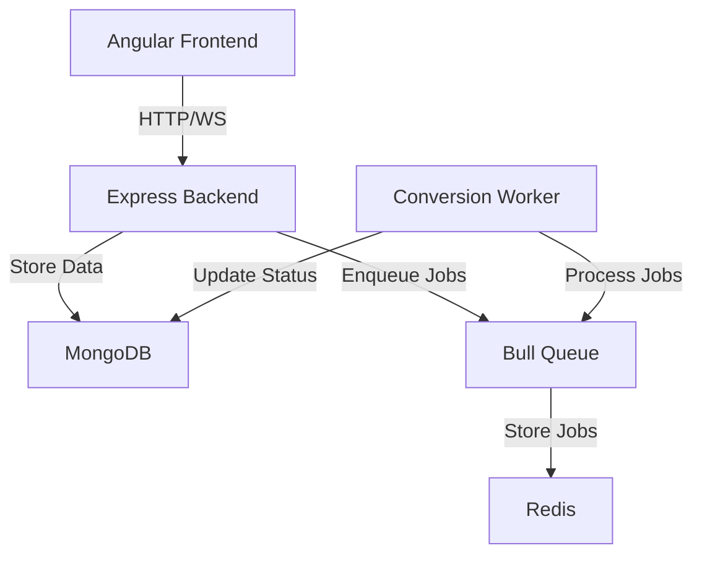

# Architecture Overview

## System Components



## Component Dependencies

### Frontend (Angular)
- Core Dependencies:
  - @angular/core, common, forms
  - @angular/material for UI
  - @ngrx/store for state management
  - socket.io-client for real-time updates

### Backend (Express)
- Core Dependencies:
  - express for HTTP server
  - bull for job queue
  - mongoose for MongoDB
  - socket.io for WebSocket
  - jsonwebtoken for auth

### Worker
- Core Dependencies:
  - bull for job processing
  - fluent-ffmpeg for video conversion
  - sharp for image processing
  - mongoose for status updates

## Data Flow

1. User Flow:
   ```
   User -> Frontend -> Backend -> Queue -> Worker -> Storage
                   |         |            |
                   |         v            v
                   |      MongoDB      Results
                   v
               Real-time Updates
   ```

2. Job Processing Flow:
   ```
   1. Frontend uploads video
   2. Backend validates and stores metadata
   3. Backend enqueues conversion job
   4. Worker picks up job from queue
   5. Worker processes video to GIF
   6. Worker updates job status
   7. Backend notifies frontend via WebSocket
   8. Frontend displays result
   ```

## Scalability Points

1. Worker Service:
   - Horizontally scalable up to 5 replicas
   - Auto-scales based on queue length
   - Resource limits per worker

2. Queue Management:
   - Bull queue with Redis backend
   - Job prioritization
   - Retry mechanisms
   - Dead letter queue

3. Storage:
   - MongoDB for metadata and user data
   - Redis for caching and queue
   - Shared volume for media files

## Security Considerations

1. Authentication:
   - JWT-based auth
   - Secure password hashing
   - Token expiration

2. File Processing:
   - Input validation
   - File size limits
   - Format verification

3. API Security:
   - Rate limiting
   - CORS configuration
   - Input sanitization

## Monitoring Points

1. Application Health:
   - Service health checks
   - Queue monitoring
   - Error tracking (Sentry)

2. Performance Metrics:
   - Conversion times
   - Queue length
   - Response times
   - Resource usage

3. Business Metrics:
   - Conversion success rate
   - User activity
   - Error rates 